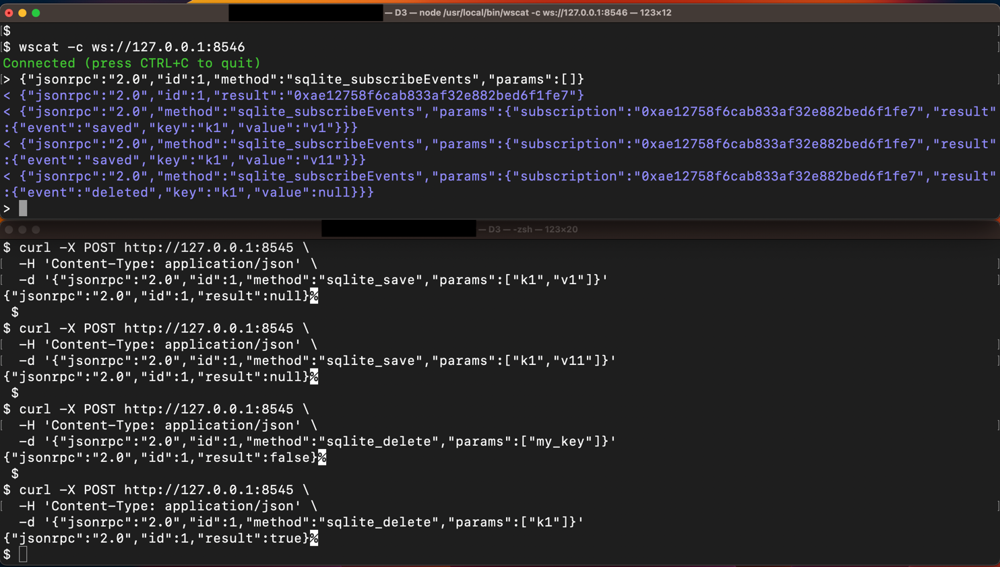
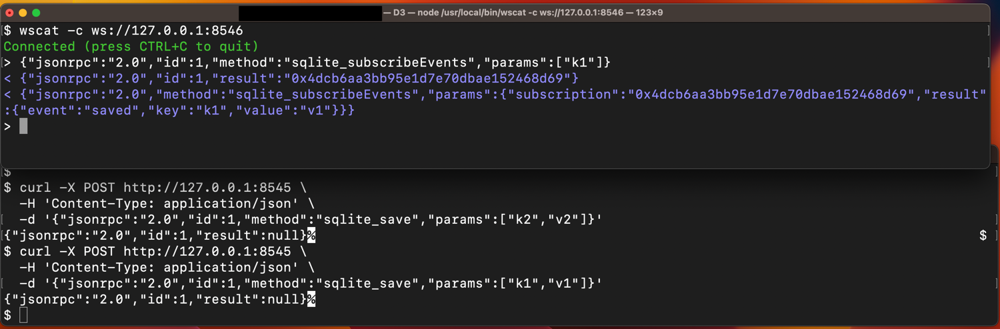
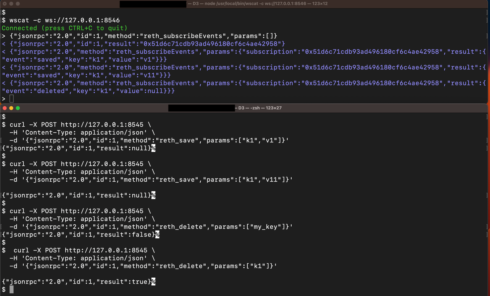

It's a [Reth](https://github.com/paradigmxyz/reth) extension that adds a custom key-value entity store
with two database backends ([SQLite](https://www.sqlite.org/) & [MDBX](https://github.com/Mithril-mine/libmdbx))
and exposes it via JSON-RPC over HTTP and WebSocket as JSON-RPC can work for both transport layers.


## Features

- **Dual storage backends** -- SQLite for lightweight/persistent use, MDBX via reth's native `DatabaseEnv` for performance
- **JSON-RPC CRUD API** -- `get`, `save`, `delete` for key-value entities
- **WebSocket subscriptions** -- real-time notifications for entity changes (`saved`/`deleted`) and new block events
  - key-filtered subscriptions -- clients can subscribe to events for a specific key only
- **CLI subcommands** -- `entity-export` and `entity-import` to move entity data in/out as JSON


## Launch Ethereum node with RPC Server
HTTP & WebSocket RPC servers can be enabled on the running node either of the following ways:
The `node` is a subcommand, not a flag, hence a space`-- node`, while no space needed for flags like `--http`.

- `cargo run -- node --http --ws`
  - - with default SQLite db of `entity.db` (check `struct CustomArgs`)
  - - with Reth's own chain database (MDBX) 
- `cargo run -- node --db-path /path/to/db` with custom SQLite path.  
Check logs for entries like
```
2026-07-18T18:01:32.292997Z  INFO reth::cli: RPC HTTP server started url=127.0.0.1:8545
2026-07-18T18:01:32.293015Z  INFO reth::cli: RPC WS server started url=127.0.0.1:8546
```
Thus Reth's JSON-RPC server started on `http://127.0.0.1:8545` (default) with the custom entity APIs enabled, 
by registering `sqlite_*` and `reth_*` RPC namespaces based on `namespace = "sqlite"`, `namespace = "reth"`
in `SqliteEntityApi` & `RethEntityApi` traits respectively.

Now we have following RPC methods available:
- [SQLite:](#sqlite-rpc-api) `sqlite_get`, `sqlite_save`, `sqlite_delete`, `sqlite_subscribeEvents`
<a id="reth-rpc-methods"></a>
- [Reth:](#reth-rpc-api) `reth_get`, `reth_save`, `reth_delete`, `reth_subscribeEvents`, `reth_subscribeBlocks`
All of these methods follow standard [JSON-RPC 2.0 specs](https://www.jsonrpc.org/specification#response_object)

## SQLite RPC API
- sqlite_save - Saves an entity.  
```bash
curl -X POST http://127.0.0.1:8545 \
  -H 'Content-Type: application/json' \
  -d '{"jsonrpc":"2.0","id":1,"method":"sqlite_save","params":["my_key","my_value"]}'
{"jsonrpc":"2.0","id":1,"result":null}
```

- sqlite_get - Gets an entity:
```bash
curl -X POST http://127.0.0.1:8545 \
  -H 'Content-Type: application/json' \
  -d '{"jsonrpc":"2.0","id":2,"method":"sqlite_get","params":["my_key"]}'
{"jsonrpc":"2.0","id":2,"result":"my_value"}
```

- sqlite_delete - Deletes an entity:
```bash
curl -X POST http://127.0.0.1:8545 \
  -H 'Content-Type: application/json' \
  -d '{"jsonrpc":"2.0","id":3,"method":"sqlite_delete","params":["my_key"]}'
{"jsonrpc":"2.0","id":3,"result":true}
```

## SQLite WebSocket API

The SQLite namespace provides WebSocket subscriptions for real-time entity change notifications.
Events include:
- `saved` - Entity was created or updated. `sqlite_save` works for both.
- `deleted` - Entity was removed

In order to send a WebSocket request, A ws client needs to be installed first: 
- [wscat](https://github.com/websockets/wscat) via `npm install -g wscat` 
- [websocat](https://github.com/vi/websocat) via `brew install websocat`


### sqlite_subscribeEvents
Subscribes to entity events & optionally supports key filtering.

First connect
```bash
wscat -c ws://127.0.0.1:8546
```
**Subscribe to all events:**
```json
{"jsonrpc":"2.0","id":1,"method":"sqlite_subscribeEvents","params":[]}
```
then send `sqlite_save` / `sqlite_delete` CURL requests (from above) in a new terminal window


**Subscribe to specific key events**
```json
{"jsonrpc":"2.0","id":1,"method":"sqlite_subscribeEvents","params":["my_key"]}
```


**Server pushes events as they happen:**
```json
{"jsonrpc":"2.0","method":"sqlite_subscribeEvents","params":{"subscription":"0x4dcb6aa3bb95e1d7e70dbae152468d69","result":{"event":"saved","key":"my_key","value":"new_value"}}}
```
## Reth RPC & WebSocket APIs
Likewise we could have similar [RPC methods](#reth-rpc-methods) & subscriptionns for `reth_` namespace.  


### reth_subscribeBlocks
Subscribes to new block notifications.
```bash
wscat -c ws://127.0.0.1:8546           
Connected (press CTRL+C to quit)
> {"jsonrpc":"2.0","id":1,"method":"reth_subscribeBlocks","params":[]}
```
To see events, in another terminal make a call that triggers a block, or just wait if your node is synced 
and producing blocks. Check `test_reth_subscribe_blocks` in `tests/reth_event_tests.rs` for a working example.

### reth_unsubscribeBlocks
Unsubscribes from block notifications.
```bash
wscat -c ws://127.0.0.1:8546           
Connected (press CTRL+C to quit)
> {"jsonrpc":"2.0","id":1,"method":"reth_subscribeBlocks","params":[]}
< {"jsonrpc":"2.0","id":1,"result":"0x1caa5dce7cc51e42b74f4fc1f1ae55b8"}
> {"jsonrpc":"2.0","id":2,"method":"reth_unsubscribeBlocks","params":["0x1caa5dce7cc51e42b74f4fc1f1ae55b8"]}
< {"jsonrpc":"2.0","id":2,"result":true}
> {"jsonrpc":"2.0","id":2,"method":"reth_unsubscribeBlocks","params":["0x1caa5dce7cc51e42b74f4fc1f1ae55b8"]}
< {"jsonrpc":"2.0","id":2,"result":false}
> 
```
`0x1caa5dce7cc51e42b74f4fc1f1ae55b8` is subscription ID, which can be used later to `reth_unsubscribeBlocks`.

### CLI Subcommands
## Export

Export all entities from a database to a JSON file.

**SQLite (default):**

```bash
cargo run -- entity-export --db-type sqlite --export-path sqlite_export.json
```
Check Unit tests under `/src/cmd/export.rs` for verification.

**MDBX:**  
Need to stop running node first. Otherwise, it gives error like `storage directory is currently in use as read-write by another process`.
To find reth data directory, check reth docs.
```bash
find ~ -name "mdbx.dat" 2>/dev/null
/Users/x/Library/Application Support/reth/mainnet/db/mdbx.dat
```

```bash
cargo run -- entity-export --db-type mdbx --conn-path ~/Library/Application\ Support/reth/mainnet/db --export-path mdbx_export.json
```

**Options:**
- `--db-type` — `sqlite` (default) or `mdbx`
- `--conn-path` — Path to database file (required for MDBX, optional for SQLite)
- `--export-path` — Output file path (default: `entities.json`)

## Import

Import entities from a JSON file into a database.

**SQLite (default):**

```bash
cargo run -- entity-import --db-type sqlite --import-path sqlite_export.json
```

**MDBX:**

```bash
cargo run -- entity-import --db-type mdbx --conn-path /path/to/mdbx --import-path mdbx_export.json
```

**Options:**
- `--db-type` — `sqlite` (default) or `mdbx`
- `--conn-path` — Path to database file (required for MDBX, optional for SQLite)
- `--import-path` — Input file path (default: `entities.json`)


## Testing
**Unit tests:**  
Check under `src/cmd` for import / export functionality.

**Integration Tests:**  
Covered under `/tests`. It spins up a standalone jsonrpsee server (no full reth node required) 
and exercise CRUD + WebSocket subscriptions for both backends.

Run all tests
```bash
cargo test
```